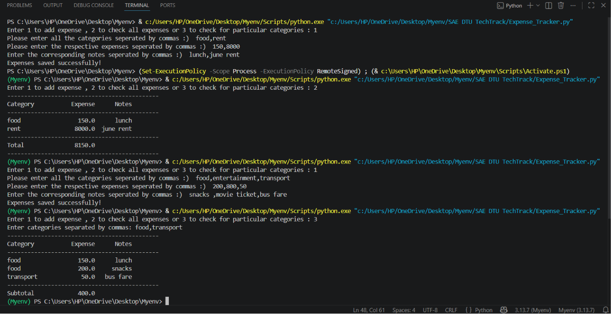

# Expense Tracker

This project allows users to manage their expenses by tracking and viewing their expense data.

## Steps to Run

1. Run the program.
2. Enter:
   - `1` → Add Expense
   - `2` → View All Expenses (+ Total)
   - `3` → View Expenses of Selected Categories (+ Subtotal)
3. If you choose `1`, enter categories, expenses, and notes separated by commas.
4. If you choose `2`, all expenses and the total are displayed.
5. If you choose `3`, enter categories separated by commas to view their expenses and subtotal.

## Screenshot

